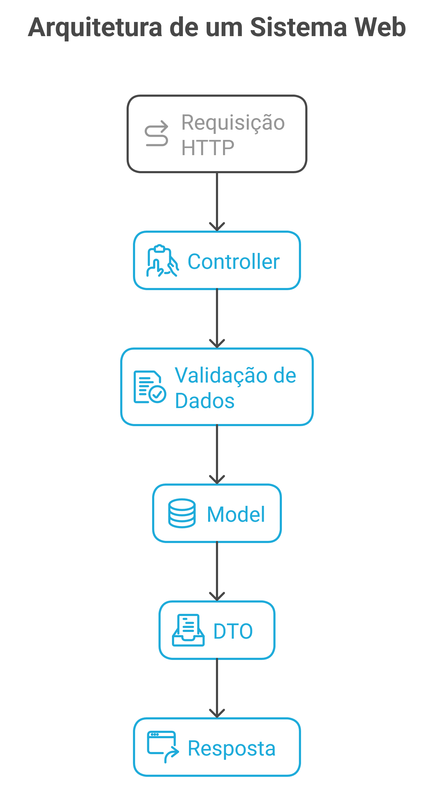
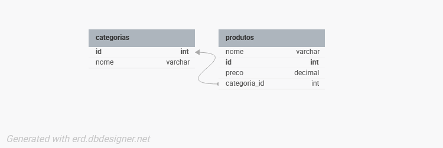

# Documentação Técnica da API de Produtos

## 1. Estrutura e Explicação das Camadas do Projeto

- **Controller**: Responsável por receber as requisições HTTP, validar dados e retornar respostas: `ProdutoController`, `CategoriaController`.
  - Os controllers são as classes que recebem as requisições da API, validam os dados e devolvem as respostas. Eles usam anotações como `@RestController` e mapeiam os métodos HTTP (GET, POST, etc). Também podem tratar erros e devolver o status certo para o cliente.
- **Model**: Representa as entidades do domínio do sistema: `Produto`, `Categoria`.
  - As models são as classes que representam as tabelas do banco de dados. Usam anotações JPA como `@Entity` e têm os campos que viram colunas. Também definem as relações, como: um produto pertence a uma categoria.
- **DTO**: Objetos de transferência de dados para respostas customizadas: `DescontoResponse`.
  - Os DTOs servem para enviar dados específicos nas respostas da API, sem precisar mostrar tudo da model. Por exemplo, o `DescontoResponse` só mostra as informações do desconto, não o produto inteiro.
- **Exception Handler**: Centraliza o tratamento de erros e personaliza as respostas de erro da API.
  - O Exception Handler pega os erros que acontecem na API e devolve uma resposta de erro mais organizada, com mensagem, status e outros detalhes para um melhor entendimento sobre o erro.



## 2. Diagrama de Classes



- Um produto pertence a uma categoria.
- Uma categoria pode ter muitos produtos.

## 3. Prints do Swagger


## 4. Regras de Negócio Implementadas

- **Produto**
  - Não permite criar produto com nome duplicado.
  - Não permite criar produto com id já existente.
  - Não permite criar produto sem categoria existente (categoria obrigatória).
  - O nome do produto deve ter entre 2 e 150 caracteres.
  - O nome do produto é obrigatório.
  - O preço do produto deve ser menor ou igual a R$ 10.000,00.
  - Se o nome do produto contiver "Promoção", o preço deve ser menor que R$ 500,00.
  - Não permite atualizar produto para nome já existente em outro produto.
  - Não permite buscar, atualizar ou deletar produto inexistente.
  - Não permite desconto maior que 50% nem menor que 0%.

- **Categoria**
  - Não permite criar categoria com nome duplicado.
  - Não permite criar categoria com id já existente.
  - O nome da categoria é obrigatório.
  - Não permite buscar, atualizar ou deletar categoria inexistente.

## 5. Exemplos de Uso da API

### Criar Categoria
**Request:**
```
POST /categorias
Content-Type: application/json

{
  "nome": "Informática"
}
```
**Response:**
```
200 OK
{
  "id": 1,
  "nome": "Informática"
}
```

### Criar Produto
**Request:**
```
POST /produtos?categoriaId=1
Content-Type: application/json

{
  "nome": "Notebook",
  "preco": 3500.0
}
```
**Response:**
```
201 Created
{
  "id": 1,
  "nome": "Notebook",
  "preco": 3500.0,
  "categoria": {
    "id": 1,
    "nome": "Informática"
  }
}
```

### Buscar Produtos por Nome
**Request:**
```
GET /produtos/buscar?nome=note
```
**Response:**
```
200 OK
[
  {
    "id": 1,
    "nome": "Notebook",
    "preco": 3500.0,
    "categoria": {
      "id": 1,
      "nome": "Informática"
    }
  }
]
```

### Calcular Preço com Desconto
**Request:**
```
GET /produtos/1/desconto?percentual=10
```
**Response:**
```
200 OK
{
  "nome": "Notebook",
  "precoOriginal": 3500.0,
  "descontoAplicado": "10%",
  "precoFinal": 3150.0
}
```

### Listar Produtos de uma Categoria
**Request:**
```
GET /categorias/1/produtos
```
**Response:**
```
200 OK
[
  {
    "id": 1,
    "nome": "Notebook",
    "preco": 3500.0,
    "categoria": {
      "id": 1,
      "nome": "Informática"
    }
  }
]
```

### Exemplo de Erro (Produto Duplicado)
**Request:**
```
POST /produtos?categoriaId=1
Content-Type: application/json

{
  "nome": "Notebook",
  "preco": 3500.0
}
```
**Response:**
```
400 Bad Request
{
  "timestamp": "2024-05-01T12:00:00",
  "status": 400,
  "erro": "Violação de regra de negócio",
  "mensagens": [
    "Já existe um produto com esse nome."
  ],
  "caminho": "/produtos"
}
```

---
